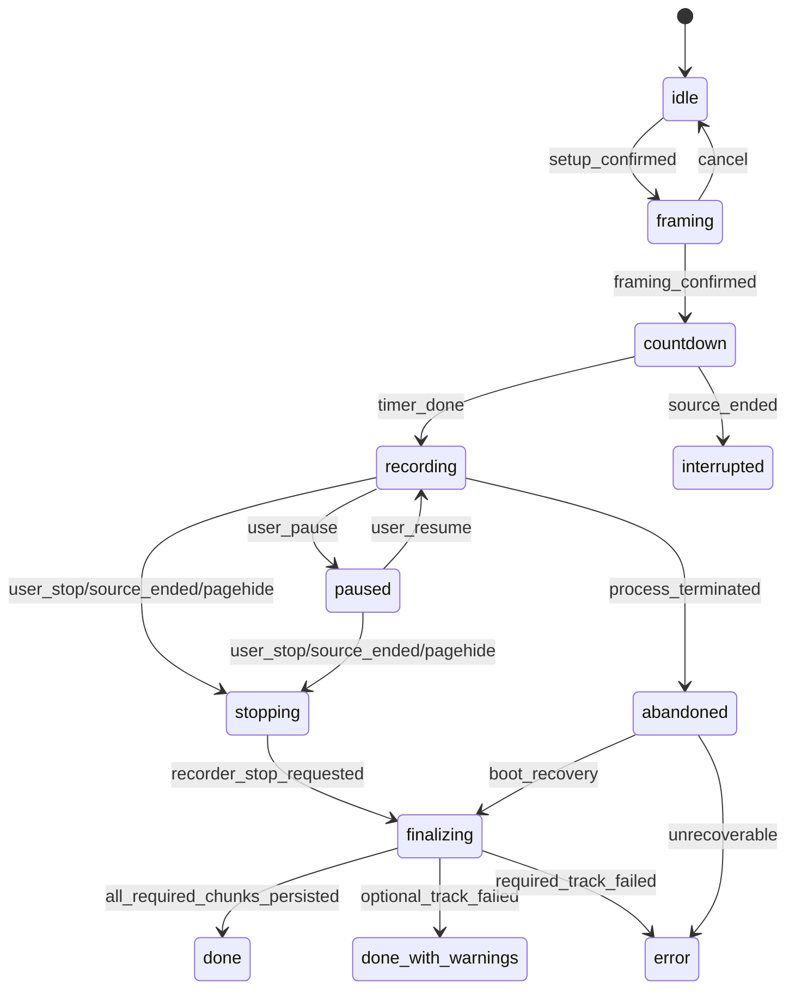
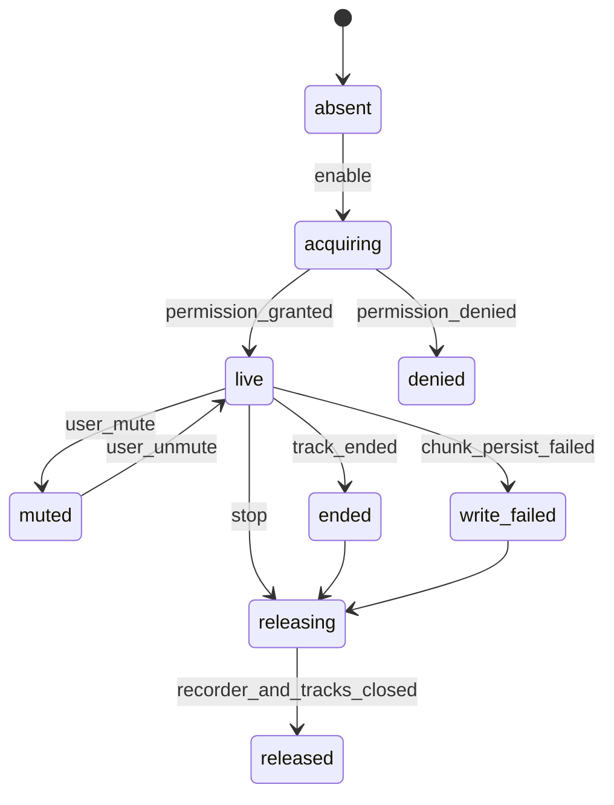
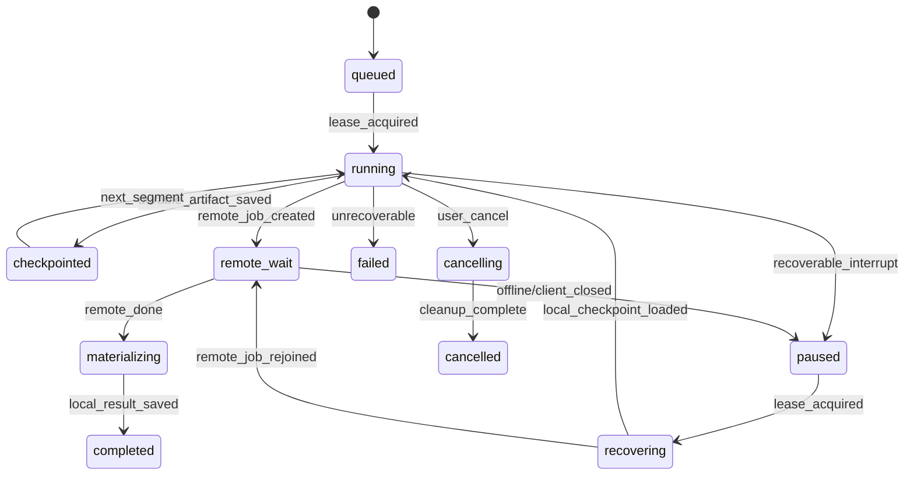

# Media lifecycle edge-case QA audit

Audit date: 2026-08-05

Branch: `codex/recovered-53c2`

Audit root: `/Users/chenzhijiang/.codex/worktrees/53c2/pro`

Post-audit implementation note (2026-08-08): the P0 chunk-write/unfinished-recording
findings, the bounded display-size probe, Paddle provider hot refresh, and Dubbing
local-materialization ordering described below have since been addressed in the same
worktree. The original evidence remains below as the audit baseline.

Scope: recording, Document PiP, camera, microphone, display capture, app navigation,
browser lifecycle, stop/finalize, preview, captions/ASR, Dubbing, ChatCut, Autozoom,
export workers/codecs, downloads, IndexedDB, private Storage, and payment-provider
switching.

## Method and constraints

- Followed Superpowers `systematic-debugging`: traced each lifecycle from event source
  to persisted state and cleanup before assigning severity or recommending changes.
- Used the independent `tests/e2e/media-lifecycle-domain.spec.ts` as a domain-level
  characterization suite. It was originally added as a RED assertion; concurrent
  implementation work has since turned the suite GREEN.
- Did not edit any existing media implementation file or existing test file.
- This report describes the current uncommitted worktree state, not only `HEAD`.

Changed files for this independent audit:

- `/Users/chenzhijiang/.codex/worktrees/53c2/pro/docs/qa/media-lifecycle-edge-cases.md`
- `/Users/chenzhijiang/.codex/worktrees/53c2/pro/tests/e2e/media-lifecycle-domain.spec.ts`

Targeted verification:

- Command: `npx playwright test tests/e2e/media-lifecycle-domain.spec.ts --reporter=line`
- Result: `3 passed`.
- Covered domain behavior: an interrupted export without a checkpoint becomes failed;
  route detachment does not release the recording session; duplicate Stop calls share
  one atomic finalization.

## Current protections already present

These are implemented and should not be reported as open defects:

- Recording ownership is application-level. Route unmount calls `detachView()` without
  stopping hardware (`src/services/recordingLifecycle.ts:24-27`), and `/app` reattaches
  the active session on mount (`src/app/[locale]/app/page.tsx:194-207`).
- Stop is single-flight (`src/services/recordingLifecycle.ts:29-44`) and requests all
  three `MediaRecorder.stop()` operations before the first asynchronous database wait
  (`src/services/recordingSession.ts:398-435`).
- Non-BFCache `pagehide` requests an interrupted stop and `beforeunload` warns the user
  (`src/components/providers/RecordingLifecycleProvider.tsx:7-22`).
- User-closing the recording-controls PiP dispatches a dedicated event
  (`src/app/[locale]/app/page.tsx:573-584`) and the opener asks whether to stop
  (`src/app/[locale]/app/page.tsx:965-974`).
- Export is owned by a locale-layout provider, not the export route component
  (`src/components/providers/MediaTaskProvider.tsx:12-84`). Internal app navigation under
  the same layout therefore does not itself cancel an active export.
- WebCodecs cancellation and hidden-tab backpressure no longer rely on timer polling;
  encoder `flush()` is AbortSignal-aware (`src/services/webCodecsExport.ts:59-77`) and
  encoders close in `finally` (`src/services/webCodecsExport.ts:246-273`).
- Cursor and blur workers settle pending requests on ordinary Worker errors
  (`src/services/cursorFocusTracker.ts:282-320`,
  `src/services/displayBlurWorker.ts:98-137`).
- Subtitle and Dubbing jobs persist remote job ids and can resume when their panels are
  reopened (`src/components/SubtitlePanel.tsx:94-112`,
  `src/components/DubbingPanel.tsx:53-77`).
- Large private uploads use TUS with retries, progress and cancellation
  (`src/services/privateMediaUpload.ts:70-111`).
- Export download URLs remain valid for 60 seconds instead of being revoked in the same
  event loop (`src/services/exportPipeline.ts:1795-1807`).

## Severity findings

### P0 - Media can be silently incomplete while the recording is marked successful

Impact:

- A quota error, IndexedDB transaction failure, revoked permission, unplugged device, or
  ended display share can produce a recording that says `done` but has missing audio,
  camera, or screen chunks. The user discovers the loss only in preview/export.

Current evidence:

- Audio chunk write errors are converted to fulfilled `undefined` promises
  (`src/services/audioRecorder.ts:49-59`).
- Camera chunk write errors are swallowed the same way
  (`src/services/cameraRecorder.ts:67-81`).
- Display chunk write errors are swallowed the same way
  (`src/services/displayCaptureRecorder.ts:259-264`).
- Finalization waits with `Promise.allSettled()` inside the recorder handles but never
  inspects rejected writes, then updates the row to the requested terminal status
  (`src/services/recordingSession.ts:407-439`).
- Audio, camera, and display recorder modules do not register `track.ended` listeners
  (`src/services/audioRecorder.ts:36-80`, `src/services/cameraRecorder.ts:61-123`,
  `src/services/displayCaptureRecorder.ts:245-279`).
- UI mute state is changed before camera reacquisition succeeds, and the hardware error
  is swallowed (`src/app/[locale]/app/page.tsx:862-885`,
  `src/services/recordingSession.ts:362-380`).

Existing coverage:

- Delayed and missing MediaRecorder stop events have E2E coverage.
- Happy IndexedDB chunk persistence is covered.
- No quota, transaction abort, permission revocation, or early-track-end injection was
  found.

Missing coverage:

- `QuotaExceededError` after N successful chunks for every track kind.
- Camera/mic/display `ended` before Stop and during pause/countdown.
- Permission revoked while recording and during camera unmute.
- Mixed success where snapshots persist but required screen media does not.

Recommended state model:

- Each track reports `absent | acquiring | live | muted | ended | write_failed | released`.
- Session finalization aggregates per-track errors and can end as
  `done | done_with_warnings | interrupted | error`.
- A required display-track write failure must never resolve as clean `done`.

### P0 - Browser close/refresh still relies on asynchronous work after `pagehide`

Impact:

- Internal route navigation is now safe, but a hard refresh, tab close, browser crash, or
  OS termination can still leave `status='recording'`/`finalizing` and lose the last
  chunks. `pagehide` does not guarantee enough time for IndexedDB and MediaRecorder
  callbacks to complete.

Current evidence:

- `beforeunload` only prompts; it does not persist an interruption marker
  (`src/components/providers/RecordingLifecycleProvider.tsx:8-12`).
- `pagehide` starts `recordingLifecycle.stop('interrupted')` without awaiting it
  (`src/components/providers/RecordingLifecycleProvider.tsx:13-16`). This is reasonable
  best effort, but the browser may terminate the page immediately.
- A recording row begins as `status: 'recording'`
  (`src/services/recordingSession.ts:98-114`) and only Stop moves it through
  `finalizing` to a terminal state (`src/services/recordingSession.ts:398-439`).
- No boot-time scan of unfinished recording rows was found.

Existing coverage:

- Domain coverage proves route detach keeps the session and duplicate Stop is atomic.
- No real `pagehide`, hard refresh, crash-reopen, or BFCache restore E2E was found.

Recommended behavior:

- Persist a synchronous/best-effort `interruptionRequestedAt` before starting async Stop.
- On application boot, scan unfinished rows and classify recoverable partial media.
- Keep BFCache (`pagehide.persisted=true`) sessions live, then reconcile tracks on
  `pageshow`; treat non-persisted unload as interrupted.

### P1 - Export checkpoints are descriptive, not resumable

Impact:

- Export survives navigation inside the app, but a refresh/crash does not continue from
  the last encoded segment. Starting again reuses the old configuration yet renders from
  frame zero. Users can see a stored checkpoint that cannot actually restore work.

Current evidence:

- The provider stores `processedFrames` and a computed `segmentIndex`
  (`src/components/providers/MediaTaskProvider.tsx:31-43`).
- `exportSegments` and save/list helpers exist
  (`src/lib/db-client.ts:242-260`, `src/lib/db-client.ts:459-464`), but repository search
  found no production caller outside `db-client`.
- A paused/failed task is restarted with its immutable config snapshot, but the checkpoint
  is not supplied to `runExport()` (`src/services/mediaTaskCoordinator.ts:71-117`).
- The export pipeline reloads media, calculates `totalFrames`, and starts its render loop
  from the beginning (`src/services/exportPipeline.ts:783-920`).
- Task ownership is guarded only by an in-memory `activeByRecording` map
  (`src/services/mediaTaskCoordinator.ts:39-42`, `src/services/mediaTaskCoordinator.ts:71-74`).
  The durable `claimMediaTask()` helper is not used, so two tabs can render the same
  recording concurrently.

Existing coverage:

- Domain tests cover checkpoint classification, coordinator hydration, deduplication in
  one JavaScript realm, and immutable config reuse.
- No restart-from-segment or two-browser-tab lease test exists.

Recommended behavior:

- Persist actual encoded segment blobs plus media/config signatures.
- Resume only when every preceding segment validates; otherwise clearly restart at 0.
- Use a lease with owner id and expiry for cross-tab claims.
- Do not label a processed-frame counter as resumable until the encoded artifact exists.

### P1 - Dubbing can finish remotely but lose the local result after route unmount

Impact:

- If the Dubbing panel unmounts while it is resuming a job, network polling continues.
  The client task can be marked `completed`, but the localized track is not saved because
  the component sees `cancelled`. Reopening the panel will not resume a completed task,
  so the generated result becomes unreachable from the UI.

Current evidence:

- Resume is launched in a component effect; cleanup only sets a boolean and does not abort
  the underlying polling loop (`src/components/DubbingPanel.tsx:53-77`).
- The Dubbing client persists `completed` before returning the `LocalizedTrack`
  (`src/services/dubbingClient.ts:113-147`).
- The component checks `cancelled` before `saveLocalizedTrack()`
  (`src/components/DubbingPanel.tsx:63-68`).
- Reopen resumes only `queued | running | paused`, not `completed`
  (`src/components/DubbingPanel.tsx:59-64`).
- The polling loop has no AbortSignal (`src/services/dubbingClient.ts:72-98`).

Recommended behavior:

- Move remote-job completion and local-track persistence into an app-level task owner.
- Persist result paths separately from local materialization state.
- Model `remote_done -> downloading_assets -> local_ready`; resume either phase.
- Add AbortSignal for panel consumers without cancelling the durable job itself.

### P1 - Remote ASR/Dubbing progress and cleanup are driven by client polling

Impact:

- If every client goes away, pending ASR does not submit upstream, stale Dubbing waits for
  a future poll, and private source objects can remain indefinitely. Retries can duplicate
  expensive Dubbing work after a stale claim.

Current evidence:

- ASR submit stores a pending job and deliberately defers upstream submission to the first
  status request (`src/app/api/asr/submit/route.ts:63-82`).
- ASR source cleanup occurs only while polling reaches a terminal branch
  (`src/app/api/asr/status/route.ts:44-103`).
- Subtitle network failures are swallowed while `pollCount` continues increasing; timeout
  changes only component state and does not persist a terminal/paused task
  (`src/components/SubtitlePanel.tsx:191-262`).
- Dubbing generation runs synchronously inside a GET status request, and a claim older than
  120 seconds is retried by the next poll (`src/app/api/dubbing/status/route.ts:35-61`).
- Dubbing source cleanup is also attached to terminal request processing
  (`src/app/api/dubbing/status/route.ts:62-135`).

Recommended behavior:

- Use a durable server worker/queue with leases, attempts, idempotency keys and heartbeats.
- Run TTL cleanup independently of browser polling.
- Distinguish transport timeout from remote job failure; a local timeout should remain
  resumable while the server job is still running.

### P1 - Display-source framing can wait forever for metadata

Impact:

- Some virtual displays or browser capture streams omit width/height settings and never
  resolve `video.play()` or `loadedmetadata`, leaving the user stuck before framing.

Current evidence:

- A bounded helper already races `play()` and metadata against 800 ms timeouts
  (`src/services/displayCaptureRecorder.ts:68-93`).
- `getDisplayStreamPixelSize()` implements a separate unbounded path instead
  (`src/services/displayCaptureRecorder.ts:132-157`).
- `/app` awaits this result before entering the framing state
  (`src/app/[locale]/app/page.tsx:719-743`).

Recommended behavior:

- Reuse `waitForVideoDimensions()` with track-setting or 1920x1080 fallback.
- Listen for display-track `ended` while permission/framing/countdown is active.

### P1 - Live payment-provider switching does not reinitialize Paddle

Impact:

- Admin broadcast can change the visible provider from Creem to Paddle, while the
  application-wide Paddle SDK remains `null` because it only fetched configuration once.
  The modal then shows Paddle but disables checkout until a page remount.

Current evidence:

- `usePaymentConfig()` subscribes to realtime provider updates
  (`src/hooks/usePaymentConfig.ts:31-63`).
- `PaddleProvider` fetches once in an effect with an empty dependency list and has no
  broadcast/focus recheck (`src/components/providers/PaddleProvider.tsx:23-59`).
- Paywall disables Paddle checkout when `paddle` is null
  (`src/components/PaywallModal.tsx:209-220`).
- Checkout routes do resolve the provider from the database per request, so the server is
  authoritative; the stale part is client SDK readiness.

Recommended behavior:

- Make `PaddleProvider` consume the same live payment config and reinitialize/clear SDK on
  provider or mode change.
- Freeze provider/mode on each checkout attempt and display that attempt's provider while
  polling entitlement.

### P2 - Upload recovery is resumable only inside the current browser invocation

Impact:

- TUS retries transient network failures, but closing or refreshing before the remote job
  is created leaves no `mediaTasks` row. A new attempt uses a new nonce/path and may not
  discover the partial upload, creating orphaned storage sessions/objects.

Current evidence:

- TUS resumes prior uploads for the current Blob/metadata fingerprint
  (`src/services/privateMediaUpload.ts:70-110`).
- ASR persists its task only after upload and submit succeed
  (`src/components/SubtitlePanel.tsx:157-177`).
- Dubbing also uploads before the job id/task record exists
  (`src/services/dubbingClient.ts:169-232`).

Recommended behavior:

- Persist `uploading` task state, stable nonce/path and byte checkpoint before upload.
- Reuse the same upload fingerprint after reload; clean abandoned prefixes by TTL.

### P2 - Worker hangs without an error event have no deadline

Impact:

- Cursor/blur workers settle normal `error` events, but a stalled worker that emits neither
  message nor error can leave a frame/analysis promise pending indefinitely.

Current evidence:

- Cursor pending requests settle on message/error/close, with no per-request timeout
  (`src/services/cursorFocusTracker.ts:282-320`).
- Blur pending requests also have no deadline
  (`src/services/displayBlurWorker.ts:98-137`).

Recommended behavior:

- Add bounded per-request deadlines and a circuit breaker; return center focus/CPU blur
  fallback after timeout.

### P2 - ChatCut and other editor mutations have no shared operation arbiter

Impact:

- ChatCut has a local `analyzing` phase, while background/config/subtitle operations remain
  independently clickable. CPU-heavy decode can delay unrelated UI, and late completion
  can overwrite timeline state changed while analysis was running.

Current evidence:

- Auto-edit snapshots `segments`, awaits analysis, then writes result without revision or
  cancellation checks (`src/app/[locale]/export/[id]/page.tsx:210-233`).
- The control disables only its own Run button while analyzing
  (`src/components/editor/AutoEditControl.tsx:35-72`).
- Analyzer media reads are now scoped by mode, which reduces load
  (`src/services/autoEditAnalyzer.ts:180-197`), but no shared editor-operation state exists.

Recommended behavior:

- Introduce operation ids/revisions. Apply results only if the source timeline revision is
  unchanged, or ask the user to reconcile.
- Move decode work to a worker where possible; do not globally disable harmless settings.

## Suggested state machines

Recording session:

Per-track lifecycle:

Durable media task:

## Detailed test matrix

| ID | Domain | Fault/event | Expected behavior | Current coverage |
| --- | --- | --- | --- | --- |
| R1 | Recording | Internal route navigation | Session and tracks remain owned; returning reattaches UI | Domain only |
| R2 | Recording | Double Stop from opener and PiP | Exactly one finalization and one terminal transition | Domain only |
| R3 | Recording | `pagehide.persisted=false` | Interruption marker persists; partial recording recoverable | Missing E2E |
| R4 | Recording | BFCache hide/show | Session remains live and tracks reconcile on `pageshow` | Missing E2E |
| R5 | Recording | Hard refresh/browser crash | Boot scan finds unfinished recording | Missing E2E |
| R6 | Recording | OS sleep then resume | Elapsed/media gaps are explicit; no negative drift | Missing manual/E2E |
| R7 | PiP | User closes PiP and chooses Stop | Single Stop, all hardware released, export route opens | Partial E2E |
| R8 | PiP | User closes PiP and declines Stop | Recording continues and controls can be reopened | Missing E2E |
| R9 | Device | Display track ends during framing | Countdown cancels; all preview tracks release | Missing E2E |
| R10 | Device | Display track ends while recording | Session finalizes as interrupted/source-ended | Missing E2E |
| R11 | Device | Camera permission revoked on unmute | UI remains muted; no false visible interval | Missing E2E |
| R12 | Device | Mic track ends while unmuted | UI and metadata report ended audio | Missing E2E |
| S1 | IndexedDB | Audio chunk quota failure | Terminal status is warning/error, not clean done | Missing fault injection |
| S2 | IndexedDB | Screen transaction abort | Required-track failure blocks clean export | Missing fault injection |
| S3 | IndexedDB | Snapshot t=0 write failure | Start fails clearly or recording is recoverable | Missing fault injection |
| S4 | IndexedDB | Delete recording with tasks/caches | All dependent rows deleted atomically | Code present; test missing |
| E1 | Export | Internal app navigation | Export continues under layout provider | Code present; E2E missing |
| E2 | Export | Browser tab hidden | WebCodecs progresses or reports codec failure; no timer stall | Domain partial/manual missing |
| E3 | Export | Refresh after encoded segment | Resume from durable segment, not frame zero | Missing implementation/test |
| E4 | Export | Two tabs start same recording | One lease wins; second observes task | Missing implementation/test |
| E5 | Export | Codec reclaimed after N frames | Resources close, one explicit fallback/retry | Partial unit; E2E missing |
| E6 | Export | Cancel during VideoEncoder flush | AbortError and durable cancelled state | Unit partial; E2E missing |
| E7 | Export | Cancel during ffmpeg exec | Worker terminates, temporary FS cleaned | Code partial; E2E missing |
| E8 | Export | Blur worker error/stall | CPU fallback within bounded deadline | Error handled; stall missing |
| E9 | Autozoom | Cursor worker error/stall | Manual Autozoom remains usable | Error handled; stall missing |
| E10 | Download | Multi-ratio second download fails | First remains valid; partial result is visible | Missing E2E |
| P1 | Preview | Play before display source initializes | Saved playback intent applies after attach | Domain coverage present |
| P2 | Preview | Rapid seek/config changes | Latest frame wins; obsolete render cancels | Domain coverage present |
| P3 | Subtitle | Refresh after ASR submit | Panel resumes by remote job id | Code present; E2E missing |
| P4 | Subtitle | Offline for longer than poll window | Task remains resumable, not falsely failed | Missing |
| P5 | Subtitle | No client polls pending job | Server worker submits and TTL cleanup runs | Missing architecture/test |
| P6 | Dubbing | Unmount during resumed result download | Remote done result materializes on reopen | Missing; current defect |
| P7 | Dubbing | Function dies after claim | Lease prevents duplicate expensive generation | Missing |
| P8 | Dubbing | Result asset fetch fails after remote done | Retry only materialization, not generation | Missing |
| P9 | ChatCut | Timeline changes during analysis | Stale result rejected or reconciled | Missing |
| P10 | Editor | Background changed during ChatCut | UI remains responsive; result revision-safe | Missing |
| U1 | Upload | Offline during TUS chunk | Retry/resume same stable asset path | In-call retry only |
| U2 | Upload | Refresh mid-upload | Upload task resumes or orphan is TTL-cleaned | Missing |
| M1 | Payment | Admin switches Creem to Paddle live | SDK initializes without reload | Missing; current defect |
| M2 | Payment | Provider changes after checkout created | Attempt keeps original provider and reconciles entitlement | Missing E2E |
| M3 | Payment | Success in another tab | Focus/visibility refresh unlocks | Code present; E2E missing |
| M4 | Payment | Webhook delayed/duplicated/out of order | Idempotent final entitlement | Domain tests partial |

## Release gates

Block production release on:

1. Propagating track-ended and IndexedDB write failures into recording terminal status.
2. Boot recovery for unfinished recording rows.
3. Real export segment persistence and cross-tab lease ownership, or removing the false
   implication that the current processed-frame checkpoint is resumable.
4. Fixing Dubbing `remote completed / local result not saved` recovery.
5. Moving ASR/Dubbing advancement and TTL cleanup out of client-poll ownership.
6. Bounding display metadata waits and worker-request stalls.
7. Reinitializing Paddle on live provider/mode changes.
8. Adding fault-injection E2E for page close, track end, quota failure, codec reclaim,
   offline recovery, two-tab ownership, and provider switching.
